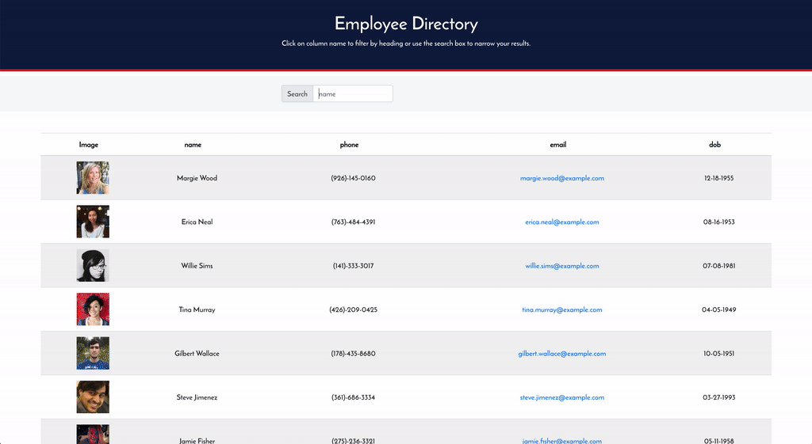

# Employee Directory System <!-- omit in toc -->

> Agile simple web application that allows users to manage non-sensitive information about their employees in a fast and efficient manner.

## 🚩 Table of Contents <!-- omit in toc -->

- [📦 Built With](#-built-with)
- [🚀 Features](#-features)
- [📜 License](#-license)

## 📦 Built With

-  [React](https://reactjs.org/)
-  [React Hooks](https://reactjs.org/docs/hooks-intro.html)
-  [randomuser.me API](https://randomuser.me/)

## 🚀 Features

-  Manage and search up your employees easily!
-  Sort your employees by their name, date of birth, phone number, or email.
-  Can run offline now!

## 📜 License

Released under the MIT License.
